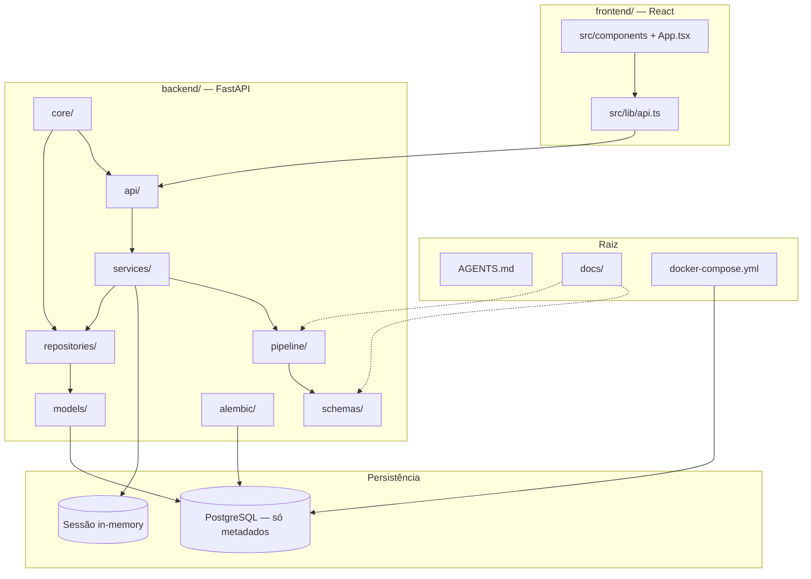

# Veritas AI

Extração inteligente de dados processuais para o PJe-Calc — projeto de Trabalho de Conclusão de Curso.

Aplicação web para contadores e peritos trabalhistas extraírem, a partir do PDF do processo, dados de cartões de ponto e holerites e exportá-los em planilha no formato esperado pelo PJe-Calc.

Este repositório implementa a **triagem em 3 camadas** e a **extração com Gemini** nas páginas candidatas. PDFs escaneados (sem texto extraível) e revisão editável permanecem como trabalho futuro.

Leia [AGENTS.md](AGENTS.md) antes de implementar. Contratos: [docs/SCHEMA_EXTRACAO.md](docs/SCHEMA_EXTRACAO.md) e [docs/PJE_CALC_LAYOUT.md](docs/PJE_CALC_LAYOUT.md).

Repositório: https://github.com/magal-dev/veritas-ai

## Estrutura do repositório

Visão geral de como as pastas se relacionam no fluxo **upload → processamento → revisão → download → descarte**:



### Mapa de pastas

```
veritas-ai/
├── AGENTS.md              # Guia para humanos e agentes: stack, privacidade, pipeline, TODOs
├── README.md              # Este arquivo — visão geral e como rodar
├── docker-compose.yml     # Postgres local (apenas metadados operacionais)
├── .env.example           # Variáveis de ambiente (copiar para .env)
│
├── docs/                  # Contratos e hipóteses documentadas
│   ├── SCHEMA_EXTRACAO.md # JSON-alvo da extração (cartão de ponto, holerite)
│   └── PJE_CALC_LAYOUT.md # Layout provisório da planilha Excel (não é o oficial)
│
├── backend/               # API e processamento (Python + FastAPI)
│   ├── main.py            # Entrada da aplicação FastAPI
│   ├── api/               # Rotas HTTP (jobs, health)
│   ├── services/          # Orquestração: sessão, upload, descarte do PDF
│   ├── pipeline/          # Estágios do processamento
│   │   ├── extractor.py   # Camadas 1–2: PyMuPDF + heurísticas (pdfplumber na shortlist)
│   │   ├── classifier.py  # Camada 3: Gemini — classificação e extração
│   │   ├── validator.py   # Validação do JSON contra regras de negócio
│   │   └── excel_builder.py # Geração do .xlsx (openpyxl)
│   ├── schemas/           # Contratos Pydantic (API + extração)
│   ├── models/            # Entidades SQLAlchemy (só metadados, sem conteúdo processual)
│   ├── repositories/      # Acesso ao PostgreSQL
│   ├── core/              # Config, database async, logging
│   ├── alembic/           # Migrations do banco
│   └── tests/             # Testes do pipeline e da API
│
└── frontend/              # Interface web (React + Vite + TypeScript)
    ├── src/
    │   ├── App.tsx        # Fluxo das 4 etapas (upload → download)
    │   ├── components/    # Telas e componentes de UI (shadcn/ui)
    │   └── lib/           # Cliente da API e tipos TypeScript
    ├── public/            # Assets estáticos (favicon)
    └── vite.config.ts     # Dev server e proxy para a API
```

| Pasta | Responsabilidade |
|---|---|
| `docs/` | Contratos de dados e layout da planilha — fonte de verdade para JSON e Excel |
| `backend/api/` | Endpoints REST: upload, status, preview, download, descarte |
| `backend/services/` | Regras de sessão stateless, tempfile do PDF, coordenação do pipeline |
| `backend/pipeline/` | Transformação do PDF em JSON validado e depois em Excel |
| `backend/schemas/` | Modelos Pydantic compartilhados entre API, pipeline e validação |
| `backend/models/` + `repositories/` | Persistência **apenas** de metadados (`processing_runs`) |
| `backend/core/` | Configuração, engine async do Postgres, logger operacional |
| `backend/alembic/` | Versionamento do schema do banco |
| `frontend/src/components/` | UI em português: upload, processamento, revisão, download |
| `frontend/src/lib/` | Chamadas à API e tipos espelhando o backend |

Dados sensíveis do processo **não** passam por `models/`, `repositories/` nem disco após o ciclo da sessão — ficam só em memória até o download.

## O que o sistema fará

1. Receber upload de processos em PDF (inclusive volumes grandes).
2. Localizar cartões de ponto e holerites sem varrer o Gemini em todas as páginas.
3. Extrair horários, salário-base e verbas para JSON validado.
4. Gerar planilha para importação no PJe-Calc.
5. Descartar PDF, JSON e Excel ao fim da sessão. Não há login nem histórico.

A planilha atual usa o layout **provisório** `provisional-0.1`. Não é o modelo oficial do PJe-Calc.

## Stack

React (Vite) · FastAPI · PostgreSQL · PyMuPDF · pdfplumber · Gemini 3.5 Flash-Lite · openpyxl · SQLAlchemy async · Alembic

## Como rodar

Portas: frontend `4174`, API `8765`, Postgres `5433`.

```bash
# 1. (Opcional) banco só para metadados operacionais — duração, status, contagem de páginas
docker compose up -d

# 2. API
cd backend
python3 -m venv .venv
source .venv/bin/activate
pip install -e ".[dev]"
cp ../.env.example ../.env
alembic upgrade head          # precisa do Postgres; se falhar, a API ainda sobe
uvicorn main:app --host 0.0.0.0 --port 8765 --reload

# 3. Interface
cd frontend
npm install
npm run dev -- --host 127.0.0.1 --port 4174
```

Abra http://127.0.0.1:4174. A API responde em http://127.0.0.1:8765/health.

Sem Docker/Postgres a aplicação continua utilizável: jobs ficam só em memória. O que deixa de ser gravado é a linha de `processing_runs`.

## Privacidade

Nenhum dado extraído do PDF é persistido. O PostgreSQL não recebe texto, JSON, CPF ou número de processo. Arquivos temporários são apagados após o uso. Em produção a comunicação deve ser HTTPS; o ambiente local usa HTTP.

## Licença

Uso acadêmico (TCC). Defina a licença quando o repositório público for criado.
