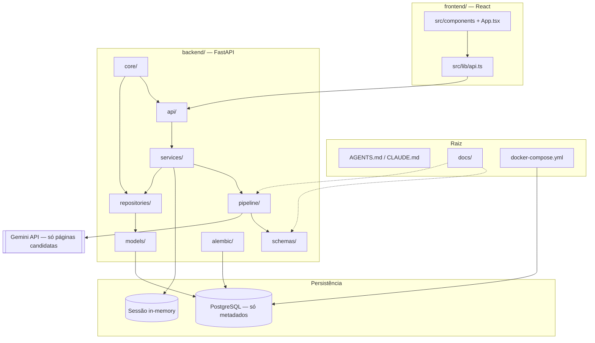

# Veritas AI

Extração inteligente de dados processuais para o PJe-Calc — projeto de Trabalho de Conclusão de Curso.

Aplicação web para contadores e peritos trabalhistas extraírem, a partir do PDF do processo, dados de cartões de ponto e holerites e exportá-los em planilha para importação no PJe-Calc.

**Estado atual:** a triagem em 3 camadas (PyMuPDF + heurísticas locais + Gemini só nas páginas candidatas) está implementada, com revisão editável dos dados extraídos (correções e resolução de conflitos antes do Excel) e geração do `.xlsx`. Páginas escaneadas entram na triagem por sinais visuais locais e o Gemini faz o OCR só nas candidatas. O layout oficial do PJe-Calc permanece como trabalho futuro.

Leia [AGENTS.md](AGENTS.md) antes de implementar (o [CLAUDE.md](CLAUDE.md) traz o guia operacional para agentes). Contratos: [docs/SCHEMA_EXTRACAO.md](docs/SCHEMA_EXTRACAO.md) e [docs/PJE_CALC_LAYOUT.md](docs/PJE_CALC_LAYOUT.md).

Repositório: https://github.com/magal-dev/veritas-ai

## Como funciona

Fluxo de uma requisição: **upload → triagem → extração → validação → revisão → download → descarte**.

1. **Camada 1 — leitura local (PyMuPDF):** extrai o texto de todas as páginas, sem custo de API, e pontua cada uma por palavras-chave e padrões tabulares.
   - Palavras **fortes** (`cartão de ponto`, `horas trabalhadas`, `holerite`, `salário bruto`, `contracheque`) identificam o tipo documental.
   - Palavras **fracas** (`entrada`, `saída`, `INSS`, `FGTS`) aparecem também em petições e pesam menos; sozinhas, sem horários ou valores, não tornam a página candidata.
   - Regex de horários (`08:00`) e valores monetários (`3.500,00`): uma página sem palavra-chave mas com muitos padrões (continuação de cartão de ponto) também entra.
2. **Camada 2 — heurísticas:** sumário do PDF (`get_toc`), vizinhos ±1 com padrão numérico e densidade de texto. A detecção de tabelas do pdfplumber, a operação local mais cara, roda só nas 10 páginas mais bem pontuadas.
3. **Camada 3 — Gemini:** até 25 páginas candidatas, renderizadas como JPEG em escala de cinza (150 DPI) e enviadas em lotes de 5 páginas por chamada, com as chamadas (no máx. 5) em paralelo (timeout de 90 s, até 3 tentativas em 429/500/503). O modelo classifica a página (`CARTAO_PONTO`, `HOLERITE` ou `IRRELEVANTE`) e devolve JSON com confiança, página de origem e campos ausentes ou ambíguos.
4. **Validação** contra o schema Pydantic e regras de formato e coerência. Horários e datas são normalizados quando a leitura é inequívoca (`8h00` → `08:00`). Valores inválidos, pares incompletos e intervalos fora da jornada são sinalizados, e duplicatas entre páginas são removidas. Valores divergentes entre páginas viram conflito para a revisão decidir: o sistema não escolhe nem inventa valor. As regras completas estão em [docs/SCHEMA_EXTRACAO.md](docs/SCHEMA_EXTRACAO.md#validação-pipelinevalidatorpy).
5. **Revisão:** a tela mostra as pendências (páginas não classificadas, campos ausentes ou a conferir, conflitos com as páginas de origem) e destaca registros de baixa confiança ou sinalizados.
6. **Excel** gerado sob demanda no download (layout provisório `provisional-0.1`, que **não é** o modelo oficial do PJe-Calc) e apagado logo após o envio.

Em um PDF sintético de 300 páginas, a triagem local (camadas 1 e 2) leva cerca de 0,2 s. Para medir na sua máquina, use `python scripts/benchmark_pipeline.py 300`.

O modelo padrão `gemini-3.5-flash-lite` foi escolhido com `scripts/evaluate_models.py`, que compara modelos contra um PDF sintético de gabarito conhecido. A acurácia em documentos reais ainda não foi medida; `scripts/evaluate_extraction.py` faz essa medição contra um gabarito feito à mão (ver "Testes e scripts").

### Interface

Fluxo em 4 etapas (upload, processamento, revisão e download), todo em português, com design system próprio (Instrument Serif + Hanken Grotesk). A interface é responsiva para celular e tem alternância entre tema claro e escuro: segue a preferência do sistema na primeira visita e guarda a escolha no navegador. Os pares de cor de texto foram revisados para contraste mínimo de 4,5:1 (WCAG AA).

### Limitações atuais

- **Sem `GEMINI_API_KEY`:** a triagem local roda, mas as candidatas ficam como "não classificadas" e nenhum dado é extraído.
- **PDF escaneado** (sem camada de texto): a triagem pontua as páginas com imagem por sinais visuais (pixmap 72 DPI, faixas de linhas e traços) e as envia ao Gemini só nas vagas que sobrarem depois das candidatas de texto (teto de 25). Páginas em branco ou com carimbo isolado são ignoradas.
- Candidatas além das 5 primeiras não vão ao Gemini; aparecem como pendência na revisão.
- A revisão permite editar cartões e holerites e salvar na sessão; o Excel só é liberado sem conflitos pendentes.

## Estrutura do repositório



### Mapa de pastas

```
veritas-ai/
├── AGENTS.md              # Fonte de verdade: stack, privacidade, pipeline, TODOs
├── CLAUDE.md              # Guia operacional para agentes (comandos, onde mexer, testes)
├── README.md              # Este arquivo — visão geral e como rodar
├── docker-compose.yml     # Postgres local (apenas metadados operacionais)
├── .env.example           # Variáveis de ambiente (copiar para .env)
│
├── docs/                  # Contratos e hipóteses documentadas
│   ├── SCHEMA_EXTRACAO.md # JSON-alvo da extração (cartão de ponto, holerite)
│   └── PJE_CALC_LAYOUT.md # Layout provisório da planilha Excel (não é o oficial)
│
├── backend/               # API e processamento (Python + FastAPI)
│   ├── main.py            # Entrada da aplicação FastAPI
│   ├── api/               # Rotas HTTP (jobs, health)
│   ├── services/          # Orquestração: sessão, upload, descarte do PDF
│   ├── pipeline/          # Estágios do processamento
│   │   ├── extractor.py   # Camadas 1–2: PyMuPDF + heurísticas (pdfplumber na shortlist)
│   │   ├── classifier.py  # Camada 3: Gemini — classificação e extração em paralelo
│   │   ├── validator.py   # Formatos, coerência da jornada, duplicatas e conflitos
│   │   └── excel_builder.py # Geração do .xlsx (openpyxl)
│   ├── schemas/           # Contratos Pydantic (API + extração)
│   ├── models/            # Entidades SQLAlchemy (só metadados, sem conteúdo processual)
│   ├── repositories/      # Acesso ao PostgreSQL
│   ├── core/              # Config, database async, logging
│   ├── alembic/           # Migrations do banco
│   ├── scripts/           # Smoke test, benchmark da triagem e comparação de modelos
│   └── tests/             # Testes do extractor, classifier, validator, Excel e API
│
└── frontend/              # Interface web (React + Vite + TypeScript + Tailwind + shadcn/ui)
    ├── src/
    │   ├── App.tsx        # Fluxo das 4 etapas (upload → download)
    │   ├── components/    # Telas (*Step.tsx), ThemeToggle e primitivos shadcn/ui
    │   └── lib/           # Cliente da API e tipos TypeScript
    ├── public/            # Assets estáticos (favicon, logos)
    └── vite.config.ts     # Dev server e proxy para a API
```

| Pasta | Responsabilidade |
|---|---|
| `docs/` | Contratos de dados e layout da planilha — fonte de verdade para JSON e Excel |
| `backend/api/` | Endpoints REST: upload, status, preview, download, descarte |
| `backend/services/` | Regras de sessão stateless, tempfile do PDF, coordenação do pipeline |
| `backend/pipeline/` | Transformação do PDF em JSON validado e depois em Excel |
| `backend/schemas/` | Modelos Pydantic compartilhados entre API, pipeline e validação |
| `backend/models/` + `repositories/` | Persistência **apenas** de metadados (`processing_runs`) |
| `backend/core/` | Configuração, engine async do Postgres, logger operacional |
| `backend/alembic/` | Versionamento do schema do banco |
| `backend/scripts/` | Ferramentas de desenvolvimento; usam só dados fictícios |
| `frontend/src/components/` | UI em português: upload, processamento, revisão, download |
| `frontend/src/lib/` | Chamadas à API e tipos espelhando o backend |

Dados sensíveis do processo **não** passam por `models/`, `repositories/` nem disco após o ciclo da sessão — ficam só em memória até o download.

## Stack

React 19 (Vite + TypeScript) · Tailwind 4 + shadcn/ui · FastAPI · PostgreSQL · SQLAlchemy async · Alembic · PyMuPDF · pdfplumber · Gemini (`gemini-3.5-flash-lite` via SDK `google-genai`) · openpyxl

## Como rodar

Portas: frontend `4174`, API `8765`, Postgres `5433`. Requer Python ≥ 3.11 e Node.js.

```powershell
# 1. (Opcional) banco só para metadados operacionais — duração, status, contagem de páginas
docker compose up -d

# 2. API (a partir de backend/)
cd backend
python -m venv .venv
.\.venv\Scripts\Activate.ps1      # Linux/macOS: source .venv/bin/activate
pip install -e ".[dev]"
copy ..\.env.example ..\.env      # Linux/macOS: cp ../.env.example ../.env
alembic upgrade head              # precisa do Postgres; se falhar, a API ainda sobe
uvicorn main:app --host 127.0.0.1 --port 8765 --reload

# 3. Interface (a partir de frontend/, em outro terminal)
cd frontend
npm install
npm run dev -- --host 127.0.0.1 --port 4174
```

Abra http://127.0.0.1:4174. A API responde em http://127.0.0.1:8765/health e a documentação OpenAPI em http://127.0.0.1:8765/docs.

### Configuração do Gemini

Preencha `GEMINI_API_KEY` no `.env` (chave do [Google AI Studio](https://aistudio.google.com/apikey)). O modelo pode ser trocado em `GEMINI_MODEL`. Sem a chave, a aplicação funciona, mas só executa a triagem local.

Sem Docker/Postgres a aplicação continua utilizável: os jobs ficam só em memória, e o que deixa de ser gravado é a linha de `processing_runs`.

## API

Prefixo `/api/v1`.

| Método | Caminho | Descrição |
|---|---|---|
| POST | `/api/v1/jobs` | Envia o PDF e processa (o arquivo existe só em tempfile durante a requisição) |
| GET | `/api/v1/jobs/{id}` | Status e metadados da sessão |
| GET | `/api/v1/jobs/{id}/preview` | JSON extraído, mantido em memória |
| PATCH | `/api/v1/jobs/{id}/extraction` | Salva correções da revisão e revalida (memória) |
| GET | `/api/v1/jobs/{id}/excel` | Download do `.xlsx` (409 se houver conflitos) |
| DELETE | `/api/v1/jobs/{id}` | Descarta a sessão |
| GET | `/health` | Verificação de saúde |

## Testes e scripts

```powershell
# Backend (a partir de backend/) — não precisa de Postgres nem de GEMINI_API_KEY
pytest
pytest tests/test_extractor.py -k nome     # teste específico

# Smoke test ponta a ponta (com a API rodando)
python scripts/generate_sample_pdf.py      # gera tests/fixtures/processo_exemplo.pdf (fictício)
python scripts/test_sample_pdf.py          # POST /jobs + GET /preview e imprime o resumo

# Medições
python scripts/benchmark_pipeline.py 300   # tempo da triagem local, sem Gemini
python scripts/evaluate_models.py          # compara modelos Gemini com gabarito sintético (usa a API)
python scripts/evaluate_extraction.py processo.pdf gabarito.json [--json m.json] [--local-only]
                                           # pipeline completo contra gabarito; imprime só métricas

# Frontend (a partir de frontend/)
npm run build                              # tsc -b + vite build
npm run lint                               # oxlint
npm test                                   # vitest
```

Os testes nunca chamam o Gemini real: usam o classificador stub ou mocks do cliente `google-genai`.

**Avaliação com processos reais.** O formato do gabarito está no topo de `scripts/evaluate_extraction.py`. A saída tem só contagens e porcentagens (recall/precisão da triagem, acurácia da classificação, horários e verbas corretos, itens inventados, chamadas e tempo). PDFs e gabaritos reais contêm dados pessoais: mantenha-os fora do repositório (a pasta `avaliacao-local/` e arquivos `*.gabarito.json` são ignorados pelo git) e apague-os ao terminar.

## Privacidade

- Não há login, cadastro nem histórico de extrações.
- Nenhum dado extraído do PDF é persistido. O PostgreSQL recebe só metadados operacionais (timestamps, status, contagem de páginas, de candidatas e de chamadas ao Gemini, código de erro), sem nome de arquivo, texto, JSON, CPF ou número de processo.
- O PDF é apagado ao fim do processamento; o Excel, logo após o download; a sessão em memória expira após `JOB_TTL_SECONDS`.
- Apenas as páginas candidatas (até 25 por processo) são enviadas como imagem à API do Gemini; o restante do documento não sai do servidor.
- Os logs registram só metadados (`job_id`, contagens, duração), nunca conteúdo das páginas.
- O navegador guarda apenas a preferência de tema (`localStorage`); nenhum dado do processo.
- Em produção a comunicação deve ser HTTPS; o ambiente local usa HTTP.

## Licença

Uso acadêmico (TCC). Defina a licença quando o repositório público for criado.
